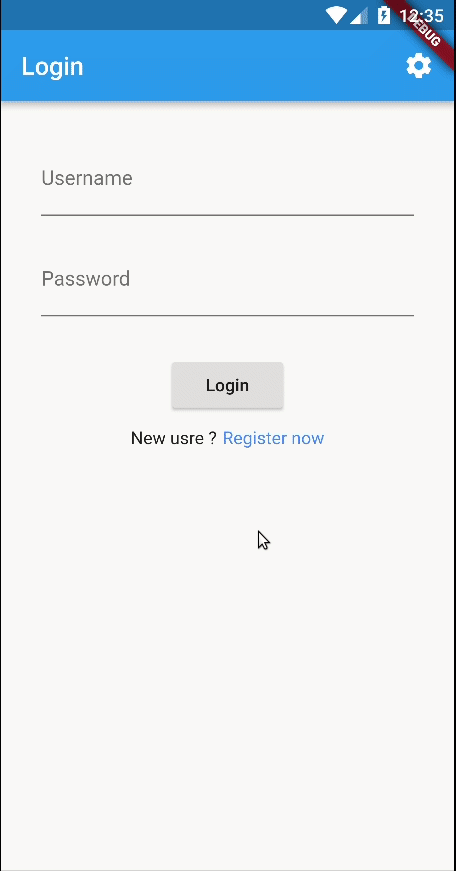

# Flutter-Flask-Login
Flutter app integrated with Flask server with login and registration functionalities 

## GIF

## How to setup
### Clone the repo 

### Flask Part
- Go to  `flask_app` directory 
- Open the terminal and type `python3 run.py` .The server will start and the database will be created 
  
### App Part
- Open the `flutter_app` with android studio 
- Run the project, it will take some time to install the dependencies 
- When the app is ready make sure the phone and the laptop are in the same network 
- Check the IP of the laptop by using `ipconfig` for windows and `ifconfig` for Linux
- When you get the IP go to the settings in the app and change the URL as shown in the GIF above 

### That's all, the app now should work as in the GIF 

#### Note: if it didn't work, check your firewall and make sure the port is allowed to respond for external requests, to check if the connection is established, open the browser in the phone and go to `http://YOU_IP:5000/` , if it shows Hello World text, then the firewall is setup and the server is working in the network 
#### For Linux the code to allow the port is `sudo iptables -A INPUT -p tcp --dport 5000 -j ACCEPT` , where 5000 is the port number

